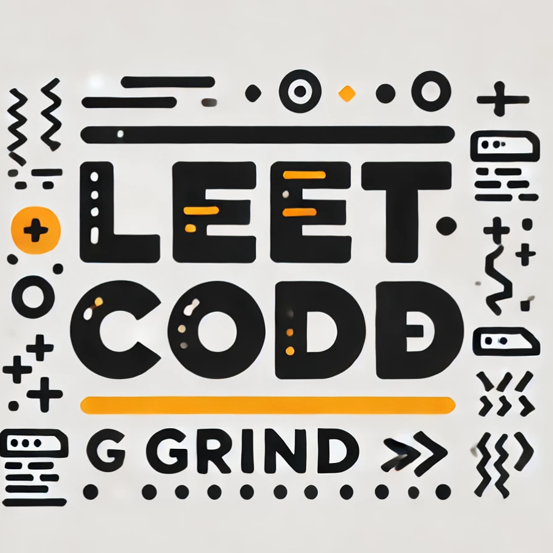

🧠 LeetCode Grind: The Grad Student Chronicles 📚💻
Repo Name: LeetCodeGrind

Welcome to the journey of a master's student on a mission: solving LeetCode problems one day (and one coffee) at a time. ☕️💼 Between classes, research papers, and late-night debugging sessions, this repo is where the real work happens—grinding through algorithms, unlocking the mysteries of data structures, and taming those intimidating problem sets. 🚀

In This Repository:

🏆 Daily Solutions — Because one problem a day keeps the coding fear away.
💪 All Levels, All Categories — Tackling everything from "Easy" to "Nightmare Fuel" (a.k.a. "Hard").
🎯 Detailed Comments and Insights — Sharing not just solutions but thought processes and strategies for that extra edge.
For the fellow coders: Grab your favorite energy drink and dive in. Let’s level up together and crush those tech interviews!

<!---LeetCode Topics Start-->
# LeetCode Topics
## Tree
|  |
| ------- |
| [0199-binary-tree-right-side-view](https://github.com/ameyrane98/LeetCodeGrind/tree/master/0199-binary-tree-right-side-view) |
## Depth-First Search
|  |
| ------- |
| [0199-binary-tree-right-side-view](https://github.com/ameyrane98/LeetCodeGrind/tree/master/0199-binary-tree-right-side-view) |
## Breadth-First Search
|  |
| ------- |
| [0199-binary-tree-right-side-view](https://github.com/ameyrane98/LeetCodeGrind/tree/master/0199-binary-tree-right-side-view) |
## Binary Tree
|  |
| ------- |
| [0199-binary-tree-right-side-view](https://github.com/ameyrane98/LeetCodeGrind/tree/master/0199-binary-tree-right-side-view) |
<!---LeetCode Topics End-->